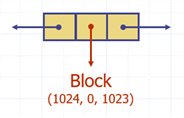
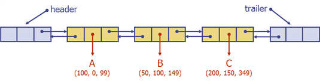
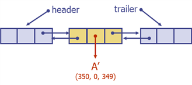
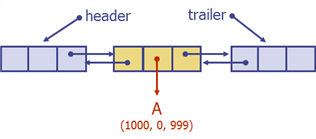
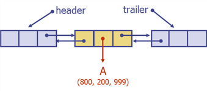
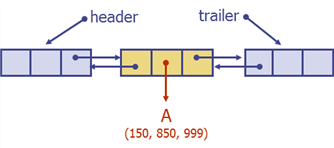
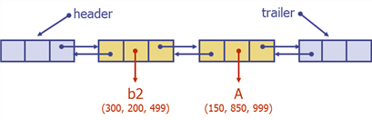
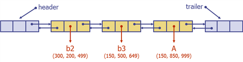
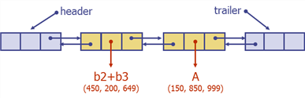

# Homework #3: Dynamic Memory Management

## Part I. Doubly Linked List 구현하기
`DLinkedList.java` 화일을 완성하시오.

### 유의 사항:
1. public method의 signature는 바꿀 수 없습니다. 단, 특정 Node를 검색하는 `find` method만 예외임. 즉, `find`의 경우 필요에 따라 signature를 나름대로 정의해서 사용할 수 있습니다.
2. 필요한 경우 private method 또는 field를 정의 할 수 있습니다.
3. `setHeaderInfo`와 `setTrailerInfo`는 검색 method(예, find) 등에서 사용 할 정보를 설정하는 용도로 사용 할 수 있습니다.
4. `toString()` method는 수정 할 수 없습니다.

## Part II. (Part I.)에서 구현한 DLinkedList를 이용하여 Memory Manager 구현하기
`Node.java`, `OutOfMemoryException.java`는 그대로 수정 없이 사용하고, `MemoryManager.java`는 나머지 부분을 완성하시오.

### MemoryManager의 기본 API:
1. `Block malloc(int size)`: free store (또는 heap)로부터 size 크기의 Block을 생성하여 반환한다. 할당이 실패 할 경우 `OutOfMemoryException`을 throw한다.
2. `void free(Block block)`: block을 free store에 돌려 준다. 내부적으로 `MemoryManager`는 heap의 상태를 갱신한다. (heap 관리 방법은 이후 설명 참조)
3. `DLinkedList<Block> getHeap()`: 관리 중인 heap을 반환한다. (이 method는 debugging 용도이며, 일반적으로는 client가 호출하지는 않는다.

### MemoryManager 구현시 유의 사항:
1. `DLinkedList`의 public method만을 사용해야 합니다.
2. `Block` class는 수정해서는 안됩니다.
3. 기존의 public methods (`malloc`, `free`, `getHeap`, `toString`) 이외의 추가 public method는 정의 할 수 없습니다. 단, private method는 필요 한 경우 추가로 정의하여 `MemoryManager` 내부에서 사용 할 수 있습니다.

## Heap 관리 방법
Heap은 free storage block의 정보를 나타내는 Node을 doubly linked list로 관리한다. 각 Node의 구조는 다음과 같다: 실제 Node의 구조는 (item, prev, next)이지만 편의상 아래와 같이 도식화 한다. item field는 Block 정보를 나타낸다.



각 Block은 (size, free block start address, free block end address)의 tuple 구조를 갖는다.

**Free block 관리 규칙은 다음과 같다:**
1. Linked List의 각 Node는 block 주소가 증가하는 순서로 관리한다.
2. malloc(size)이 요청된 경우, 최소 size 이상의 크기를 갖는 free block을 first-fit 방법으로 찾는다. First-fit이란 list의 첫 번째 node부터 차례로 검색하여 맨 먼저 찾은 node (즉, 크기가 size 이상인 node)를 선택함을 의미한다. 이 경우 선택된 free node의 block의 크기와 start address가 갱신된다.
3. free에 의해 반납된 block이 free list에 추가될 경우, 반납된 free block을 free list의 해당 위치에 삽입한다. 단, 새로 삽입된 free block이 기존의 free block과 인접한 경우, 하나의 free block으로 병합(merge)되어야 한다.

**Before merge:**



**After merge:**



**실행 시나리오:**
1. Free block list의 초기 상태 (free storage의 용량을 1000으로 가정)
```agsl
MemoryManager manager = new MemoryManager(1000);
```



2. 메모리 크기 200을 요청한다.
```agsl
Block b1 = manager.malloc(200)    // b1 = Block(200, 0, 199)
```
메모리(200)의 요청이 성공 한 이후 free block list의 상태:



3. 메모리 크기 300, 150, 200을 연속으로 요청 받은 이후 free block list의 상태:
```agsl
Block b2 = manager.malloc(300)    // b2 = Block(300, 200, 499)
Block b3 = manager.malloc(150)    // b3 = Block(150, 500, 649)
Block b4 = manager.malloc(200)    // b4 = Block(200, 650, 849)
```



4. 할당 받았던 block b2 (Block(300, 200, 499)) 반환 처리 이후 free block list의 상태:
```agsl
manager.free(b2)
```



5. 할당 받았던 block b3 (Block(150, 500, 649)) 반환 처리 이후 free block list의 상태:
```agsl
manager.free(b3)
```



b2 block과 b3 block이 주소가 연속된 block이므로 하나의 free block으로 merge 함.


