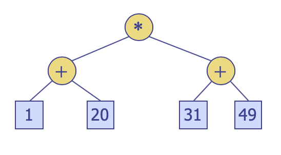
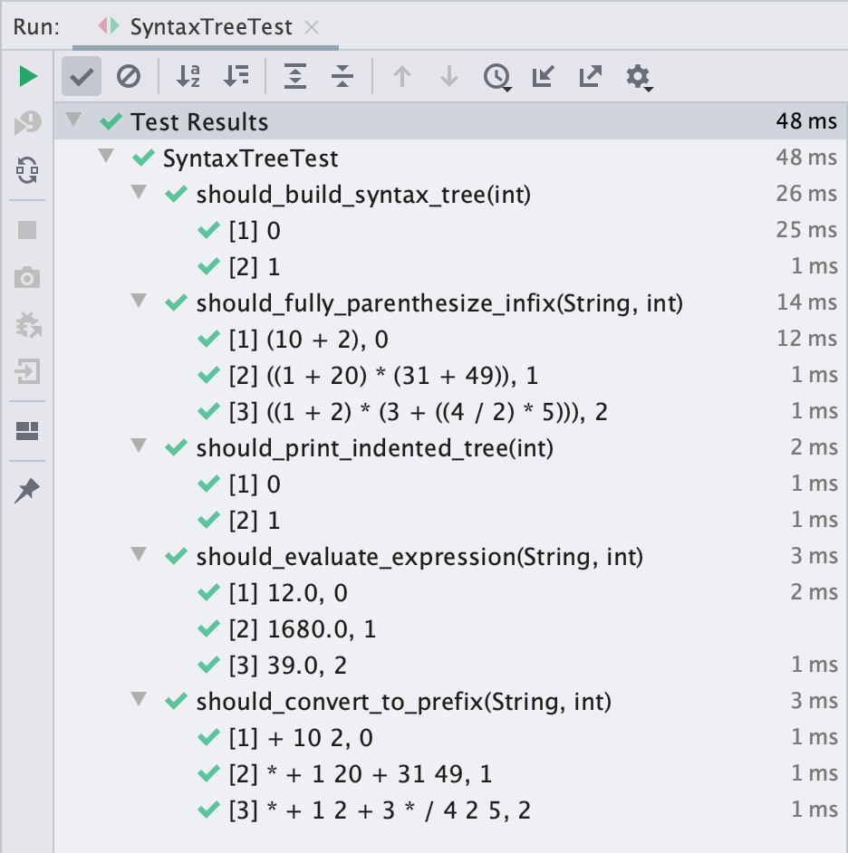

# Homework #5

## Problem
Construct arithmetic expression trees from either postfix or infix expressions.

Complete the skeleton class `SyntaxTree.java` and `TreeBuilder.java` shown below:

You must use the accompanied binary tree implementation located in `cse2010.hw5.tree`. The package contains link-based, tree-related classes discussed in lecture. The codes are almost identical to the ones in the textbook. The test code, `LinkedBinaryTreeTest` will help you understand how some core methods are used.

```agsl
public class TreeBuilder {
    private static Map<String, Integer> operators = new HashMap<>();
    static {
        // We will consider only four binary operators: *, /, +, -
        operators.put("(", 1);
        operators.put("*", 1);
        operators.put("/", 1);
        operators.put("+", 1);
        operators.put("-", 1);
        operators.put(")", 1);
        // you may put other entry/entries if needed ...
    }

    private static Stack<SyntaxTree> operandStack = new Stack<>();
    private static Stack<String> operatorStack = new Stack<>();

    /**
     * Construct a syntax free from postfix arithmetic expression.
     */
    public static SyntaxTree buildFromPostfix(String expression) {
        initStacks();

        /**
         * You code goes here ...
         */

        return new SyntaxTree();
    }

    /**
     * Construct a syntax free from infix arithmetic expression.
     */
    public static SyntaxTree buildFromInfix(String expression) {
        initStacks();

        /**
         * You code goes here ...
         */

        return null;
    }

    private static void initStacks() {
        operandStack.clear();
        operatorStack.clear();
    }
}
```

* The `TreeBuilder` provides two construction methods: `buildFromInfix` and `buildFromPostfix`. Constructing a syntax tree from a postfix expression is relatively straight-forward. But, it maybe (very) **hard** to construct it from an infix expression. So, you’d better start with `buildFromPostfix` first.
* The `Map` is a simple data structure that stores (name, value) pairs. We can retrieve a value from the `Map` using key like this: For this homework, the **key** is the **operator symbol** and the **value** is the operator’s **precedence**.

```agsl
private static Map<String, Integer> operators = new HashMap<>();
...
operators.put("(", 7);
...
int precedence = operators.get("(");  // null if not found
...
```

1. `buildFromPostfix` constructs an expression tree from a postfix expression.
```agsl
SyntaxTree tree = SyntaxTree.buildFromPostfix("1 20 + 31 49 + *");
```
will generate tree like this



* Use `TreeUtil.parse()` to parse the expression and generate an array of string tokens from it

```agsl
// expression = "1 20 + 31 49 + *"
String[] tokens = parse(expression); // [1, 20, +, 31, 49, +, *]
```

* All operators and operands are stored as `String` in each tree node as an element.
* Only four binary operators (`*`, `/`, `+`, `-`) need to be supported.
* Each operand is a single letter string or an integer represented as string, possibly with multiple digits.
* If you need `Stack`, you can use the stack defined in **Java’s collection library (java.util.Stack)**. Note that the `java.util.Stack` uses `peek()` instead of `top()`.

2. `buildFromInfix` constructs an expression tree from an infix expression. All the codes below
```agsl
SyntaxTree tree = SyntaxTree.buildFromInfix("(1 + 20) * (31 + 49)");
SyntaxTree tree = SyntaxTree.buildFromInfix("((1 + 20) * (31 + 49))");
``` 
will generate the same tree as above figure.

* The same guidelines given for `buildFromPostfix` also apply here. `TreeUtil.parse()` can still be used to parse the infix expression and generate an array of string tokens from it.
```agsl
// expression = "(x + 20) * (y + 49)"
String[] tokens = parse(expression); // [(, x, +, 20, ), *, (, y, +, 49, )]
```
* Operator precedence is crucial when we construct syntax trees **from infix expressions**. Especially, “(” and “)” also need to be considered as operators when builing trees from infix expressions.
* You ***must*** define operator’s precedence properly.
* You ***can*** define additional operator constants, if needed.
* **Hint:** One or more operators’ precedence(s) need to be changed whether it is (or they are) inside the operator stack or not.

As for the SyntaxTree class, you need to define one public evaluate method, and two private toInfix and indentTree methods.
```agsl
public class SyntaxTree extends LinkedBinaryTree<String> {

    /**
     * Evaluate syntax tree.
     */
    public double evaluate() {
        /**
         * Your code goes here ...
         */
        return 0d;
    }

    /**
     * Returns postfix expression corresponding to this syntax tree.
     */
    public String toPostFix() {
        return cvtToString(postOrder());
    }

    /**
     * Returns prefix expression corresponding to this syntax tree.
     */
    public String toPreFix() {
        return cvtToString(preOrder());
    }

    /**
     * Returns fully parenthesized infix expression corresponding to this syntax tree.
     */
    public String toInfix() {
        return toInfix(root());
    }

    /**
     * Returns fully parenthesized infix expression corresponding to this syntax subtree.
     */
    private String toInfix(Position<String> position) {
        /**
         * Your code goes here ...
         */
        return null;
    }

    /**
     * Returns a formatted string representation of tree hierarchy.
     * The formatted string representation of the expression tree corresponsing
     * to {@code (a + b) * (c - d)} looks as follow:
     * *
     *   +
     *     a
     *     b
     *   -
     *     c
     *     d
     */
    public String showTree() {
        return indentTree(root(), 0);
    }

    /**
     * Returns a formatted string representation of the subtree hierarchy.
     * @param level indentation level; 0 means no indentation; the unit of
     *              the indentation level is two spaces.
     */
    private String indentTree(Position<String> position, int level) {
        Node<String> node = validate(position);
        StringBuilder builder = new StringBuilder();

        /**
         * You code goes here...
         */

        return builder.toString();
    }

    /**
     * Convert list of Positions to a serialized string in which
     * each element of the position is delimited by the ' ' character.
     */
    private String cvtToString(List<Position<String>> positions) {
        return positions.stream().map(Position::getElement).collect(Collectors.joining(" "));
    }
}
```
1. `toInfix` should generate fully parenthesized infix expression of the tree.
```agsl
tree.toInfix() ==> "((1 + 20) * (31 + 49))"
```
**Note the spaces around each operator.**

2. `evaluate` calculates the arithmetic expression represented by the tree. Of course, if you use letters to denote operands, the expression cannot be evaluated. (You may safely ignore this case.)
```agsl
tree.evaluate() ==> "1680.0"
```
Evaluation should be performed as **double** arithmetic.

3. `showTree` prints the tree as properly indented depending on the depth of each node.
```agsl
tree.showTree() ==> "*\n"
                  + "  +\n"
                  + "    1\n"
                  + "    20\n"
                  + "  +\n"
                  + "    31\n"
                  + "    49\n"
```
The root node has 0 indentation. Nodes at level i should be indented as much as `depth * 2` spaces.

## How to test?
If everything works fine, the test results may look something similar like below:

